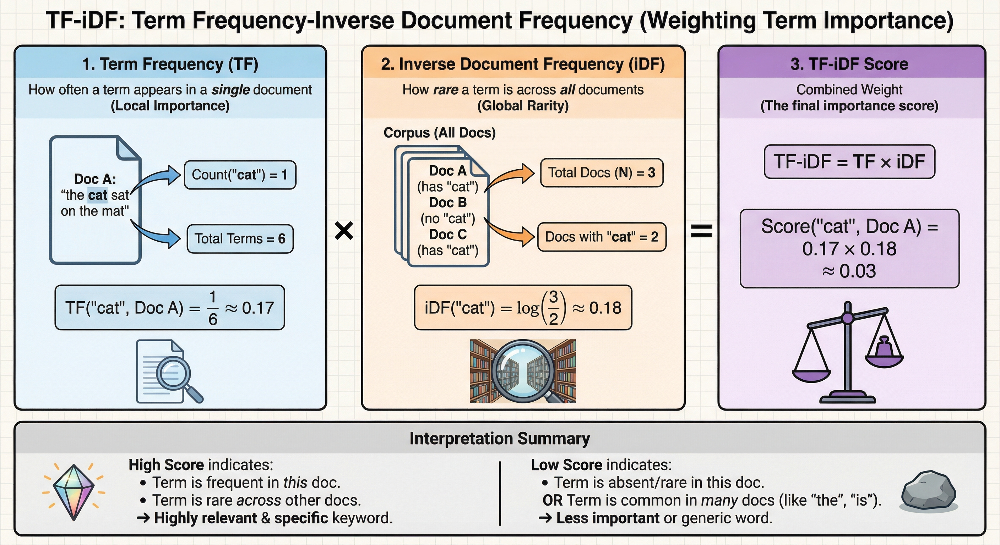
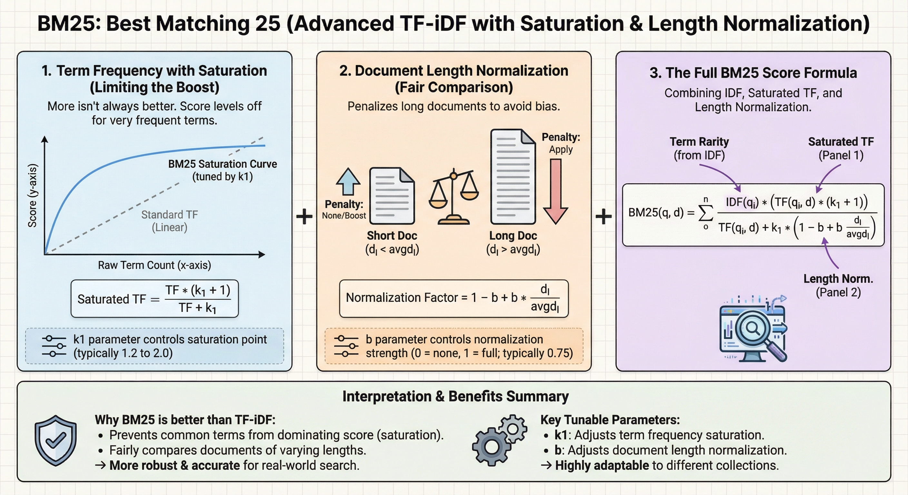

# TF-IDF

**Term Frequency - Inverse Document Frequency**

Scores terms by local importance × global rarity.

**TF (Term Frequency)**: How often term appears in document. Raw count or normalized (e.g., count/total_terms).

**IDF (Inverse Document Frequency)**: log(total_docs / docs_containing_term). Rare terms across corpus = higher weight.

**TF-IDF = TF × IDF**

High score = term frequent in this doc but rare overall. Filters common words ("the", "is"), highlights distinctive terms.

**Document Ranking**:

For query with multiple terms, sum TF-IDF scores across all query terms:
$$\text{score}(q, d) = \sum_{t \in q} \text{TF}(t, d) \times \text{IDF}(t)$$

Rank documents by descending score. Higher score = more relevant.

**Example**: Query "python machine learning"

- Doc A: high TF for both terms, rare in corpus → high score
- Doc B: mentions "python" 100x, "learning" 0x → medium score (linear growth problem)
- Doc C: only common words → low score

**Limitation**: TF grows linearly. Term appearing 100x vs 10x gets 10× weight, even though relevance doesn't scale linearly. BM25 fixes this.



---

# BM25

**Best Match 25** - probabilistic ranking function, improved TF-IDF.

**Formula**:
$$\text{BM25}(q,d) = \sum_{t \in q} \text{IDF}(t) \cdot \frac{f(t,d) \cdot (k_1 + 1)}{f(t,d) + k_1 \cdot (1 - b + b \cdot \frac{|d|}{\text{avgdl}})}$$

Where:

- $f(t,d)$: term frequency in doc
- $|d|$: doc length
- $\text{avgdl}$: avg doc length
- $k_1$: term frequency saturation (typical: 1.2-2.0)
- $b$: length normalization (typical: 0.75)

**How it works**:

**1. Term Frequency Saturation** (numerator):
$$\frac{f(t,d) \cdot (k_1 + 1)}{f(t,d) + k_1}$$

Asymptotically approaches $k_1 + 1$ as $f(t,d) \to \infty$.

- Term appearing 1x vs 2x: significant boost
- Term appearing 50x vs 100x: minimal boost
- Prevents keyword stuffing from dominating
- $k_1$ controls saturation speed. Higher $k_1$ = slower saturation = more weight to repetition.

**Saturation examples** ($k_1 = 1.5$, limit = $k_1 + 1 = 2.5$):

```
f=1:   (1 × 2.5) / (1 + 1.5)   = 2.5/2.5   = 1.00 (40% of limit)
f=2:   (2 × 2.5) / (2 + 1.5)   = 5.0/3.5   = 1.43 (57%)
f=3:   (3 × 2.5) / (3 + 1.5)   = 7.5/4.5   = 1.67 (67%)
f=5:   (5 × 2.5) / (5 + 1.5)   = 12.5/6.5  = 1.92 (77%)
f=10:  (10 × 2.5) / (10 + 1.5) = 25.0/11.5 = 2.17 (87%)
f=20:  (20 × 2.5) / (20 + 1.5) = 50.0/21.5 = 2.33 (93%)
f=50:  (50 × 2.5) / (50 + 1.5) = 125/51.5  = 2.43 (97%)
f=100: (100 × 2.5) / (100+1.5) = 250/101.5 = 2.46 (98.5%)
f→∞:   approaches 2.5 (100%)

Notice: f=1→2 adds 0.43, but f=50→100 adds only 0.03
```

**2. Length Normalization**:
$$1 - b + b \cdot \frac{|d|}{\text{avgdl}}$$

Penalizes long docs (more opportunity for term matches by chance).

- $b = 0$: no normalization (all docs treated equally)
- $b = 1$: full normalization (longer docs penalized proportionally)
- $b = 0.75$: balanced (typical)

**Length penalty examples** ($b = 0.75$, avgdl = 100):

```
|d|=25:  1 - 0.75 + 0.75×(25/100)  = 0.25 + 0.1875 = 0.4375 (boost: divide by less)
|d|=50:  1 - 0.75 + 0.75×(50/100)  = 0.25 + 0.375  = 0.625  (boost)
|d|=100: 1 - 0.75 + 0.75×(100/100) = 0.25 + 0.75   = 1.000  (neutral)
|d|=200: 1 - 0.75 + 0.75×(200/100) = 0.25 + 1.5    = 1.750  (penalty: divide by more)
|d|=500: 1 - 0.75 + 0.75×(500/100) = 0.25 + 3.75   = 4.000  (heavy penalty)

Smaller value in denominator → larger final score → better ranking
```

**Why this improves search**:

- **Keyword stuffing resistance**: Repeating "python" 1000x doesn't game rankings
- **Fairness**: Short focused doc can outrank long unfocused doc
- **Probabilistic foundation**: Models probability of relevance, not just term matching
- **Tunable**: Adjust $k_1$, $b$ for domain (e.g., short tweets vs long articles)

Standard in search engines (Elasticsearch, Lucene). Better handles repeated terms and varying doc lengths.


